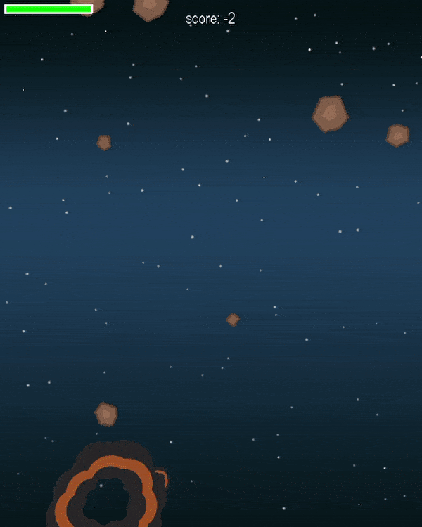

# Rage_of_Orion :video_game: :rocket: :sparkles:

### A retro style shooting game.

In this simple game, you're piloting your spaceship through the galaxy, but a hero isn't a hero without some difficulties. Save your ship while avoiding or destroying meteors sent by the angry god Orion. Grab yourself some powerups and make your way to your home.

---

## Requirements

Python 3.6 or later along with pygame 1.9.5. To install pygame run:

```bash
$ pip install pygame==1.9.5
```

---

## Gameplay



---

## How to play

Just run the Rage_of_Orion.py by either double clicking or through the command line as:

```bash
$ python3 Rage_of_Orion.py
```


Start the game by pressing any key


Shoot using:    __`Space`__ key


Move using:     __`Arrow`__ keys    


Total lives:    __`3`__


Watch out for the meteors, if hit your health bar will deplete!


Powerups:

  * __`Shield`__ :        Invincible for the duration the shield is active.


  * __`Supercharge`__ :   Fires multiple bullets for the duration the power is active.

---

## Assets

The images used were from the [Space shooter redux](https://opengameart.org/content/space-shooter-redux) art pack.

The background music is [Frozen Jam](https://opengameart.org/content/frozen-jam-seamless-loop) and the other sound assets were collected from [Bfxr](https://www.bfxr.net/).
